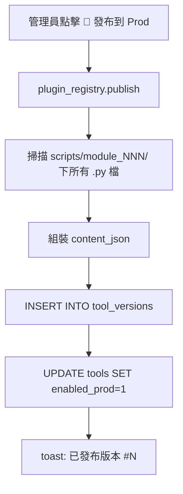

# 管理中心（Management Center）

## 概要

| 項目 | 值 |
|---|---|
| **tool_id** | `management-center` |
| **runner** | `management_runner.py` |
| **用途** | 管理員專用介面，提供工具生命週期管理、版本控制、Sheet 設計、權限設定與系統維護功能 |

---

## 四個分頁

### 分頁 1：工具管理

| 功能 | 說明 |
|---|---|
| 系統狀態 | 查詢 control API `GET /tools/active/status` |
| 搜尋 | 即時過濾工具名稱或 ID |
| 批次操作 | 多選工具後批次「發布至 PROD」或「取消發布」|
| 🚀 發布到 Prod | `reg.publish(plugin_id)` → 打包 .py 至 `tool_versions.content_json`，設 `enabled_prod=1` |
| ↩ 取消發布 | 設 `enabled_prod=0` |
| 版本歷史 | 列出所有已發布版本，可「↩ 回溯至此版本」|
| 📦 移至封存 | 設 `enabled=0` |

### 分頁 2：頁面（Sheet）管理

- 新增頁面 + 拖曳式分頁組合器
- 從 `sheet.yaml` 同步至 DB
- Dev/Prod 啟用切換

### 分頁 3：權限設定

目前為 Placeholder（唯讀）。已定義角色：`admin`、`viewer`。

### 分頁 4：系統

- 資料庫備份（匯出 JSON）
- 資料表概覽

---

## 版本發布機制

